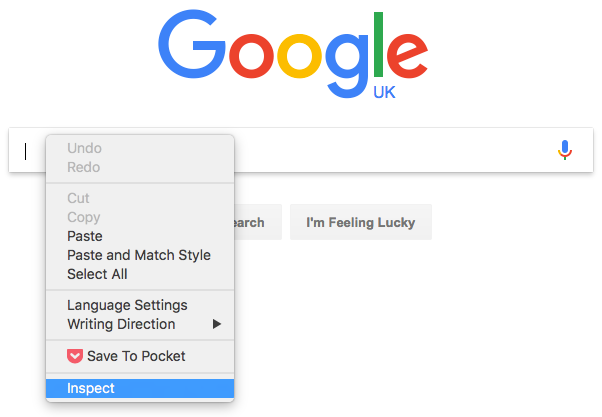
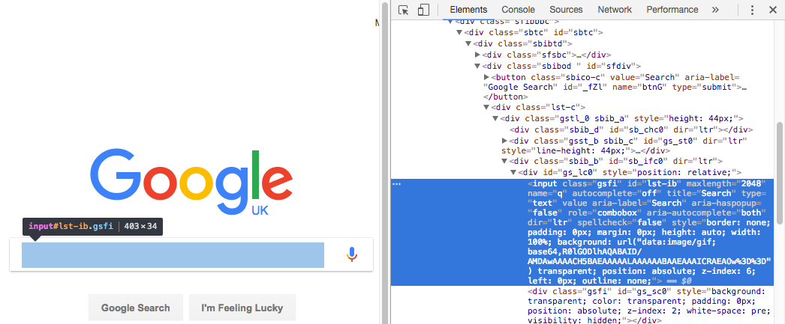

[[home]](../README.md)

# Introducing Selenium


## Overview

### Objectives

- describe principles around Selenium testing
- learn how to write some simple Selenium tests
- introduce a reusable Maven `pom.xml`

### Prerequisites

- completion of [Introducing jUnit](../step-1-junit/README.md)
- completion of [TDD Fibonacci using jUnit](../step-2-tdd-fibonacci-junit/README.md)
- completion of [Introducing Maven](../step-3-maven-fibonacci/README.md)


## Selenium essentials

### Purpose

Selenium is a tool that allows us to write automated tests to check that a website functions as expected.

### Concepts

With Selenium, we can write Java programs that do the following:

- open a browser at a given URL
- find any HTML element on the page
- interact with a found element &ndash; for example click a button, enter text in an input field, etc
- wait for a specified element to appear on the page before proceeding


## Creating a Selenium test

### Create the test class

The starter code already contains an empty class for the test.

> Open the `Selenium3ExampleIT.java` class in your IDE.

You will see the following:

- several `import`s
- several `private` variables

These will all be used once we have finished this lesson.

### Add the `@BeforeClass` annotation

The `@BeforeClass` annotation allows us to specify code that is run once _before any of the tests are run_.

We can use this to create an instance of the Chrome browser. Add the following annotation and method before the end of the class:

```java
    @BeforeClass
    public static void beforeAll() {
        startUrl = "http://www.google.co.uk/";
        driver = new ChromeDriver();
        wait = new WebDriverWait(driver, 10);
    }
```

Note:

- `startUrl` is the URL that will be used to start each test with
- `driver` represents the web browser that will be created
- we will use `wait` to wait for a condition to occur on the web page 

### Add the `@AfterClass` annotation

The `@AfterClass` annotation executes code _after all the tests have been run_.

So we want to close the browser that we previously opened. Add the following annotation and method before the end of the class:

```java
    @AfterClass
    public static void afterAll() {
        driver.close();
        driver.quit();
    }
```

### Add the `@Before` annotation

As we have done previously with jUnit, we can specify code to be executed before every test.

In our case, we want the browser to go back to the starting URL:

```java
    @Before
    public void beforeEach() {
        driver.get(startUrl);
    }
```

Note that the way we tell the browser to go to a specific URL is by calling the `get()` method on the `driver` instance, and pass in a Java `String` that contains the URL we want to go to.

### Add a simple test

Now that we have the scaffolding out of the way, we can add a simple test.

We are going to check to see if the `<title>` element on the web page is an expected value:

```java
    @Test
    public void checkPageTitleOnInit() {
        assertEquals("Google", driver.getTitle());
    }
```

Note that we are not actually directly specifying an HTML element to search for &ndash; the interface provided by Selenium contains a `getTitle()` method that does this for us.

### Run the tests

Here's the command to run the integration tests from your terminal:

```bash
mvn clean verify
```

### Add a more complex test

We are now going to test what happens when we perform a search on Google:

- find the input box for the search
- simulate typing in a search term
- click the **Google Search** button
- check what happens to the `<title>` element on the page

Here's the code to execute that test:

```java
    @Test
    public void checkPageTitleAfterSearch() {
        WebElement searchField = driver.findElement(By.name("q"));
        searchField.sendKeys("Sausages!");
        searchField.submit();
        // Google's search is rendered dynamically with JavaScript, so wait for the page to load.
        result = wait.until(new ExpectedCondition<Boolean>() {
            public Boolean apply(WebDriver driver) {
                return driver.getTitle().toLowerCase().startsWith("sausages!");
            }
        });
        assertTrue(result);
    }
```

Note the following:

- we locate the search field by calling `driver.findElement()` with a parameter that defines where the search field is
- this is found by calling `By.name("q")` &name; which means that there is an input element that has a `name` attribute of `q` _(more on this later)_
- once we have found the search field, we can call the `sendKeys()` method to enter text
- and then call the `submit()` method to submit the form
- the next block of code looks complex, but is simple in concept: it is waiting until the `<title>` contains an expected value
- if that does not happen within the specified time, the test will fail

> Run the tests again

### Finding HTML elements

So: how did we know how to find the HTML input element for the search box?

It's not possible to know just by looking at the website&hellip; we need to view the HTML elements.

To do this, just right-click inside the text input box, and one of the menu items should be **Inspect** &ndash; click this:



The developer toolbar should now be open in the **Elements** tab:



In the _Elements_ tab on the right, you can see the `<input>` element highlighted, and on the next line (still highlighted) you can see `name="q"` &ndash; this tells us that the `name` attribute of the search field has a value of `q` (presumably short for "query").


## Maven

The `pom.xml` file included in this repository is reusable in other projects &ndash; with minor modifications to the test class, you can use a different browser to test with.


## Conclusion

### What we've covered

- learned principles around Selenium testing
- learn how Selenium tests are written, and written some basic tests ourselves
- introduced a reusable Maven `pom.xml`

### Further reading

- http://www.seleniumhq.org/docs/03_webdriver.jsp#selenium-webdriver-api-commands-and-operations
- http://www.seleniumhq.org/docs/03_webdriver.jsp
- http://www.seleniumhq.org/
- http://www.seleniumhq.org/projects/webdriver/
- https://github.com/Ardesco/Selenium-Maven-Template
